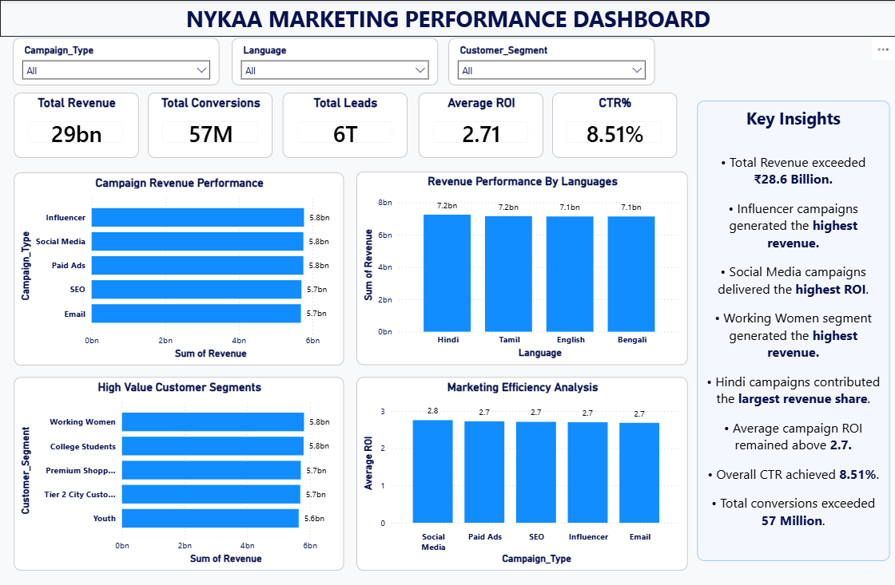

#  Nykaa Marketing Campaign Performance Analysis

##  Project Overview

This project analyzes **Nykaa's Marketing Campaign Performance** using **Python and Power BI**. The objective is to evaluate campaign effectiveness, measure marketing KPIs, identify high-performing customer segments, and provide actionable business insights to improve marketing ROI and revenue.

---

##  Business Objective

The project aims to answer important marketing questions such as:

- Which campaign type generates the highest revenue?
- Which customer segment contributes the most revenue?
- Which marketing channels perform the best?
- Which language reaches the largest audience?
- How effective are campaigns in terms of ROI, CTR, and Conversion Rate?

---

##  Tools & Technologies

- Python
- Pandas
- NumPy
- Matplotlib
- Power BI

---

##  Project Structure

```text
Nykaa-Marketing-Performance-Analysis
│
├── Dataset
│   ├── nykaa_campaign_data.csv
│   └── marketing_campaign_cleaned.csv
│
├── Notebook
│   └── Nykaa_Marketing_Analysis.ipynb
│
├── Dashboard
│   ├── Nykaa_Marketing_Dashboard.pbix
│   ├── Dashboard.pdf
│   └── Dashboard.png
│
├── README.md
├── requirements.txt
└── LICENSE
```

---

##  Dashboard Preview



---

##  Key Business Insights

-  Total campaign revenue exceeded **₹28.65 Billion**.
-  **Influencer Campaigns** generated the highest overall revenue.
-  **Social Media Campaigns** achieved the highest average ROI.
-  **Working Women** contributed the highest customer revenue.
-  Hindi campaigns generated the highest total revenue among all languages.
-  Overall campaign CTR was **8.51%**.
-  Overall Conversion Rate reached **22.03%**.
-  Average Revenue per Conversion was approximately **₹499**.
-  Influencer campaigns recorded the highest average engagement score.

---

## 🔍 Project Workflow

###  Data Cleaning

- Loaded dataset using Pandas
- Checked data types
- Verified missing values
- Removed duplicate records
- Explored categorical features
- Prepared cleaned dataset for dashboard development

###  Exploratory Data Analysis (EDA)

Analyzed:

- Campaign Type
- Customer Segment
- Marketing Channels
- Language Performance
- Revenue
- ROI
- Clicks
- Impressions
- Conversions
- Engagement Score

###  Marketing KPI Analysis

Calculated important marketing metrics:

- Total Revenue
- Total Impressions
- Total Clicks
- Total Conversions
- Average ROI
- Click Through Rate (CTR)
- Conversion Rate
- Revenue per Conversion

###  Power BI Dashboard

Designed an interactive dashboard including:

- Total Revenue KPI
- Total Campaigns KPI
- Total Conversions KPI
- Average ROI KPI
- Revenue by Campaign Type
- ROI by Campaign Type
- Revenue by Customer Segment
- Revenue by Language
- Campaign Distribution
- Interactive Filters
- Business Insights Panel

---

##  Repository Contents

-  Python Notebook
-  Raw Dataset
-  Cleaned Dataset
-  Power BI Dashboard (.pbix)
-  Dashboard PDF
-  Dashboard Screenshot

---

##  Skills Demonstrated

- Data Cleaning
- Exploratory Data Analysis (EDA)
- Marketing Analytics
- KPI Analysis
- Data Visualization
- Dashboard Development
- Business Intelligence
- Power BI Reporting
- Business Insights

---

##  Future Improvements

- Customer Lifetime Value (CLV) Analysis
- Marketing Attribution Analysis
- Predictive Campaign Performance Modeling
- ROI Forecasting
- Automated Power BI Dashboard Refresh

---

##  Author

**Dhruv Kumar**

Aspiring Data Analyst | Business Analyst | Marketing Analyst

### Connect with Me

- GitHub: https://github.com/dhruv0030
